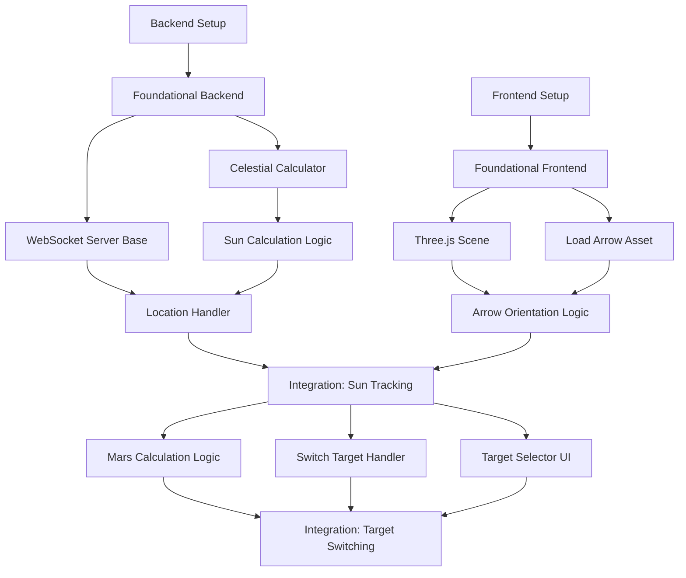

# Tasks: Omni-Compass Core Architecture

**Feature Branch**: `001-core-architecture`
**Status**: In Progress

## Dependencies

## Phase 1: Setup

**Goal**: Initialize project structure and dependencies for both Backend and Frontend.

- [ ] T001 Create backend directory structure and requirements.txt in `backend/`
- [ ] T002 [P] Initialize Vite + TypeScript project in `frontend/`
- [ ] T003 [P] Download Skyfield ephemeris data (de421.bsp) to `backend/src/domain/data/`
- [ ] T004 [P] Add 3D arrow asset to `frontend/public/assets/arrow.fbx`

## Phase 2: Foundational

**Goal**: Establish core building blocks (Skyfield logic, WebSocket server, 3D Scene) required for all stories.

- [ ] T005 Implement CelestialCalculator class in `backend/src/domain/calculator.py`
- [ ] T006 Create basic FastAPI WebSocket server in `backend/src/main.py`
- [ ] T007 [P] Setup Three.js scene (camera, light, renderer) in `frontend/src/scene/SceneManager.ts`
- [ ] T008 [P] Implement AssetLoader to load arrow.fbx in `frontend/src/scene/AssetLoader.ts`

## Phase 3: User Story 1 - Real-time Sun Tracking (P1)

**Goal**: Enable users to see the arrow pointing at the Sun based on their location.
**Independent Test**: Hardcode a location in frontend, verify arrow points to Sun's calculated position.

### Backend Implementation
- [ ] T009 [US1] Add Sun calculation method to CelestialCalculator in `backend/src/domain/calculator.py`
- [ ] T010 [US1] Implement WebSocket handler for UPDATE_LOCATION in `backend/src/api/websocket_handler.py`
- [ ] T011 [US1] Implement periodic POSITION_UPDATE push loop in `backend/src/api/websocket_handler.py`

### Frontend Implementation
- [ ] T012 [P] [US1] Implement LocationService to get Geolocation in `frontend/src/services/LocationService.ts`
- [ ] T013 [P] [US1] Implement WebSocketService to handle connection and messages in `frontend/src/services/WebSocketService.ts`
- [ ] T014 [P] [US1] Implement DeviceOrientationService in `frontend/src/services/DeviceOrientationService.ts`
- [ ] T015 [US1] Connect services to SceneManager to update arrow rotation in `frontend/src/scene/SceneManager.ts`

### Integration
- [ ] T016 [US1] Integrate all components in `frontend/src/main.ts` and verify Sun tracking

## Phase 4: User Story 2 - Switch Celestial Targets (P2)

**Goal**: Allow users to switch tracking to Mars (and potentially others).
**Independent Test**: Select "Mars" in UI, verify arrow redirects.

### Backend Implementation
- [ ] T017 [US2] Update CelestialCalculator to support Mars/Planets in `backend/src/domain/calculator.py`
- [ ] T018 [US2] Implement WebSocket handler for SWITCH_TARGET in `backend/src/api/websocket_handler.py`

### Frontend Implementation
- [ ] T019 [P] [US2] Create TargetSelector UI component in `frontend/src/components/TargetSelector.tsx`
- [ ] T020 [US2] Update WebSocketService to send SWITCH_TARGET in `frontend/src/services/WebSocketService.ts`

## Phase 5: Polish & Cross-Cutting

**Goal**: Handle edge cases and improve stability.

- [ ] T021 Implement error handling for WebSocket disconnection in `frontend/src/services/WebSocketService.ts`
- [ ] T022 Add iOS permission request UI for DeviceOrientation in `frontend/src/components/PermissionRequest.tsx`
- [ ] T023 Add unit tests for CelestialCalculator in `backend/tests/test_calculator.py`

## Implementation Strategy

1.  **MVP (Phase 1-3)**: Focus solely on getting the Sun tracking working. This proves the core loop: Location -> Backend -> Calculation -> Frontend -> 3D Update.
2.  **Extension (Phase 4)**: Once the pipeline is solid, adding Mars is just a parameter change in the calculation and a new message type.
3.  **Refinement (Phase 5)**: Address the "real-world" issues like iOS permissions and network flakiness last, as they are not blocking the core logic validation.
